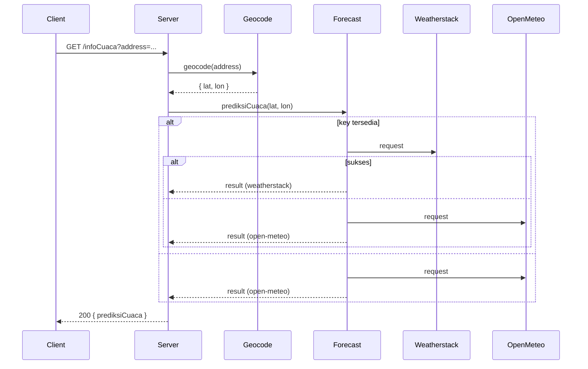

# Strato Nimbus

> Aplikasi demo untuk cek cuaca dan berita dengan fallback provider dan caching ringan.

Ringkasan singkat (Bahasa Indonesia)
- Server: Node.js + Express
- Templating: Handlebars (`hbs`)
- Klien: static JS di `public/js/app.js`
- Utilitas: `src/utils/geocode.js`, `src/utils/prediksiCuaca.js`, `src/utils/berita.js`

Fitur utama
- Mencari lokasi (geocoding) menggunakan Photon (komoot).
- Mendapatkan prediksi cuaca dengan dua provider: Weatherstack (jika ada API key) dan Open‑Meteo sebagai fallback.
- Halaman Berita yang mengambil data dari MediaStack, dengan retry/fallback ke cache saat rate-limit.
- Caching in-memory sederhana untuk mengurangi panggilan API eksternal.

Persiapan & menjalankan (Windows PowerShell)
1. Pasang dependensi:
```powershell
npm install
```
2. Siapkan environment variables (opsional tapi disarankan): buat file `.env` di root atau set di shell:
```powershell
# $env:MEDIASTACK_KEY = 'your_mediastack_key'
# $env:WEATHERSTACK_KEY = 'your_weatherstack_key'
# contoh menjalankan sementara di PowerShell
$env:MEDIASTACK_KEY = 'PASTE_KEY_DI_SINI'
```
3. Jalankan server development (nodemon):
```powershell
npm run dev
```
4. Buka browser ke `http://localhost:4000`

Script npm penting
- `npm start` — jalankan server dengan `node src/app.js`
- `npm run dev` — jalankan server dengan `nodemon` untuk development
- `npm test` — jalankan unit tests (Jest)
- `npm run lint` — jalankan ESLint autofix pada `src/` dan `public/js`

Environment variables yang digunakan
- `MEDIASTACK_KEY` — (opsional) kunci API MediaStack untuk halaman Berita
- `WEATHERSTACK_KEY` — (opsional) kunci API Weatherstack untuk meningkatkan hasil cuaca
- `PORT` — (opsional) port server (default: 4000)

Catatan operasional
- Jika API eksternal rate-limit, aplikasi akan menggunakan cache lokal (jika tersedia) untuk berita/prediksi.
- Semua komentar kode utama telah diterjemahkan ke Bahasa Indonesia dan beberapa variabel lokal sudah diberi nama yang lebih deskriptif.

Struktur direktori penting
- `src/` — kode server (Express + util)
  - `src/app.js` — entry server dan route
  - `src/utils/geocode.js` — util geocoding
  - `src/utils/prediksiCuaca.js` — util forecast (Weatherstack + Open‑Meteo fallback)
  - `src/utils/berita.js` — util MediaStack + cache
- `public/` — aset klien (CSS, JS, gambar)
- `templates/` — views (Handlebars)
- `tests/` — test unit (Jest)

Kontribusi & perbaikan
- Linting: jalankan `npm run lint` sebelum commit
- Test: jalankan `npm test` dan pastikan semua test lulus
- Jika Anda ingin mengganti logo header, ganti `templates/partials/header.hbs` SVG atau gunakan file statis di `public/img`.

Lisensi
- Proyek ini contoh/demo — sesuaikan lisensi bila diperlukan.
# Strato Nimbus — Web Server Praktikum

Strato Nimbus adalah aplikasi web edukasional untuk mengecek kondisi cuaca secara cepat.

## Ringkasan
- Aplikasi mencari koordinat dari alamat (geocoding), lalu mengambil data cuaca dari layanan eksternal.
- Provider utama: Weatherstack (optional, memerlukan API key).
- Fallback: Open‑Meteo (tanpa API key).
- Server dibangun dengan Express dan Handlebars (`hbs`).

## Cara menjalankan (pengembangan)
1. Pasang dependensi:
   ```powershell
   npm install
   ```
2. (Opsional) Set API key Weatherstack untuk menggunakan provider utama:
   ```powershell
   $env:WEATHERSTACK_KEY = 'masukkan_api_key_anda'
   ```
3. Jalankan server:
   ```powershell
   npm run start
   ```
4. Buka browser:
   - Halaman utama: http://localhost:4000/
   - Halaman bantuan: http://localhost:4000/bantuan
   - Halaman tentang: http://localhost:4000/tentang
   - Endpoint API: http://localhost:4000/infoCuaca?address=Jakarta

## Testing & linting
- Jalankan tes unit (Jest):
   ```powershell
   npm test
   ```
- Jalankan ESLint autofix:
   ```powershell
   npm run lint
   ```

Catatan: Pada Windows, skrip `test` menambahkan `NODE_OPTIONS=--experimental-vm-modules` secara otomatis untuk memungkinkan test menggunakan dynamic import ketika diperlukan.

## Arsitektur Singkat

Strato Nimbus dirancang sebagai aplikasi web server kecil yang mengikuti alur RESTful sederhana. Berikut ringkasan arsitektur dan komponen inti:

- Client (browser) — mengirim permintaan ke endpoint internal: `/infoCuaca?address=...`.
- Server Express — menerima request, memanggil utilitas `geocode` untuk mengonversi alamat ke koordinat, lalu memanggil utilitas `prediksiCuaca`.
- `geocode` — menggunakan Photon (komoot) untuk memetakan alamat -> { latitude, longitude, location } dan menerapkan cache in-memory singkat.
- `prediksiCuaca` — mencoba provider utama (Weatherstack) bila `WEATHERSTACK_KEY` tersedia; jika gagal atau tidak ada key, menggunakan Open‑Meteo sebagai fallback. Fungsi ini juga menerapkan cache in-memory untuk mengurangi permintaan berulang.

Gambaran visual (diagram RESTful) ada di: `public/img/RESTful API.png`

Untuk dokumentasi lebih lengkap tentang alur, kontrak endpoint, dan rekomendasi produksi, lihat `docs/ARCHITECTURE.md`.

### Diagram ringkas (preview)

Jika viewer Anda mendukung Mermaid, lihat `docs/ARCHITECTURE.md` untuk diagram lengkap. Berikut adalah preview ringkas yang juga ditampilkan sebagai gambar SVG bila renderer tidak mendukung Mermaid:


